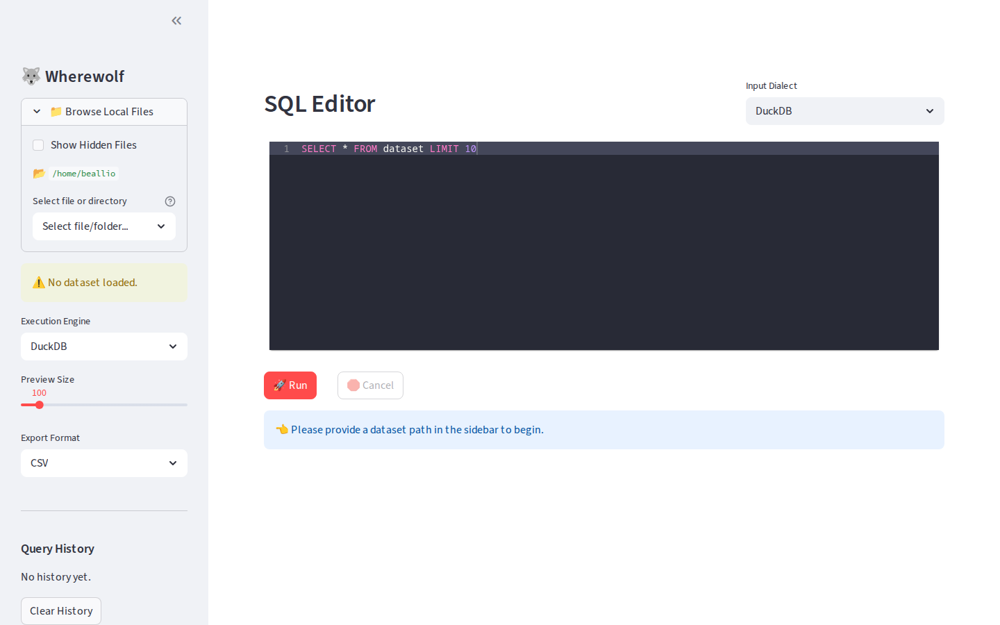

# Wherewolf 🐺

[](https://github.com/beallio/wherewolf/actions/workflows/ci.yml)
[](https://pypi.org/project/wherewolf/)
[](https://opensource.org/licenses/MIT)

A production-grade, local SQL workbench for querying files (CSV, Parquet, JSON) using DuckDB or Spark.

## Features
- **Multi-Engine Support:** Execute SQL via DuckDB (local) or Spark (local[*]).
- **SQL Translation:** Real-time translation between DuckDB and SparkSQL dialects using SQLGlot.
- **Safe Preview:** Scrollable results limited to 1000 rows.
- **Query History:** Persists past queries in `~/.wherewolf/history.json`.
- **Export:** Download query results as CSV, Excel, or Parquet.
- **Execution Metrics:** Tracks row count and execution time.



## Installation

Ensure you have [uv](https://github.com/astral-sh/uv) installed.

### From PyPI (Recommended)
```bash
uv tool install wherewolf
wherewolf
```

### From Source
```bash
git clone https://github.com/beallio/wherewolf.git
cd wherewolf
uv sync
```

## Usage

If running from source:
```bash
uv run streamlit run src/wherewolf/app.py
```

1. Enter the local path to your dataset in the sidebar.
2. Write your SQL query (use `dataset` as the table name).
3. Click **Run** to execute.
4. View results and execution metrics.
5. Export or view the translated SQL if needed.

## Development

Run tests:
```bash
uv run pytest
```

Lint/Format:
```bash
ruff check . --fix
ruff format .
```

For information on how to release new versions, see [RELEASING.md](docs/RELEASING.md).

## Dependencies
- `streamlit`
- `duckdb`
- `pyspark`
- `ibis-framework`
- `sqlglot`
- `pandas`
- `pyarrow`
- `openpyxl`
